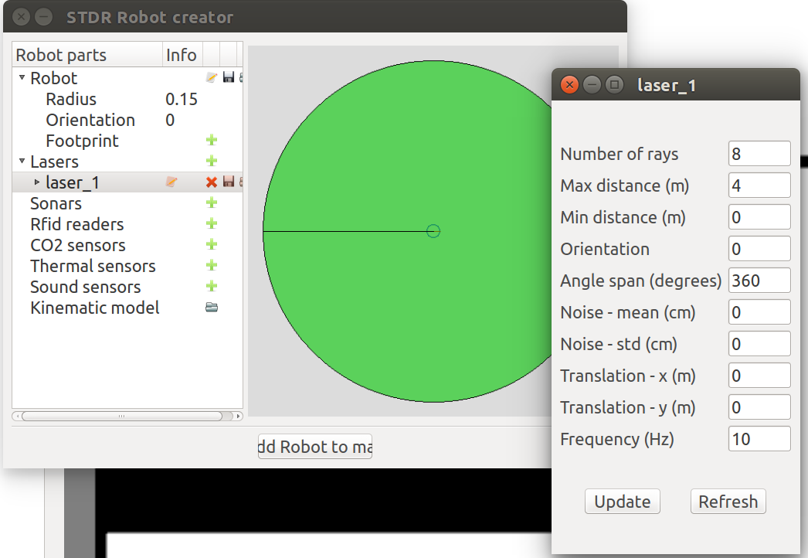

# Como executar seu código no simulador

Faça um git pull no robot17

    roslaunch projeto2 server_with_map_and_gui.launch

    roslaunch stdr_launchers rviz.launch

Para usar o teleop vai ser preciso redirecionar o cmd_vel para o robô que está sendo simulado:

    rosrun teleop_twist_keyboard teleop_twist_keyboard.py cmd_vel:=robot0/cmd_vel

## Adicionar um robô

Clique na opção Create Robot na interface do simulador STDR

